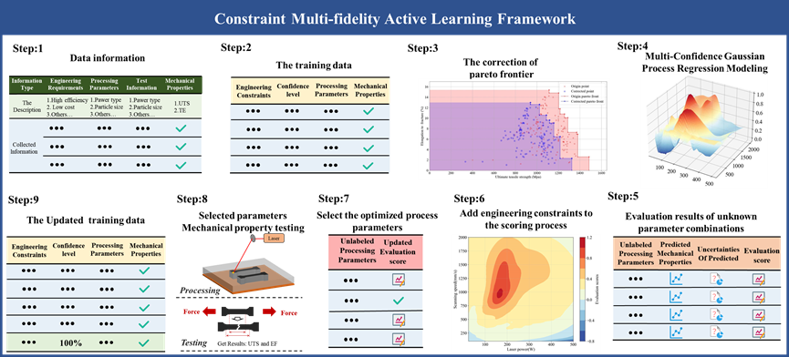

# Constrained-multi-fidelity-active-learning-framework

# data
This study constructed a comprehensive Ti-6Al-4V LPBF database covering a wide range of process-performance relationships,
containing 138 sets of processing parameters and corresponding mechanical properties from 46 papers. 
The collected parameters included laser power, scanning speed, volume energy density,
powder type, particle size, layer thickness, spacing, scanning strategy, rotation angle, 
and spot size; the mechanical properties included ultimate tensile strength (UTS) and overall elongation at break (TE).

# original_literature
All the original_literature can be found